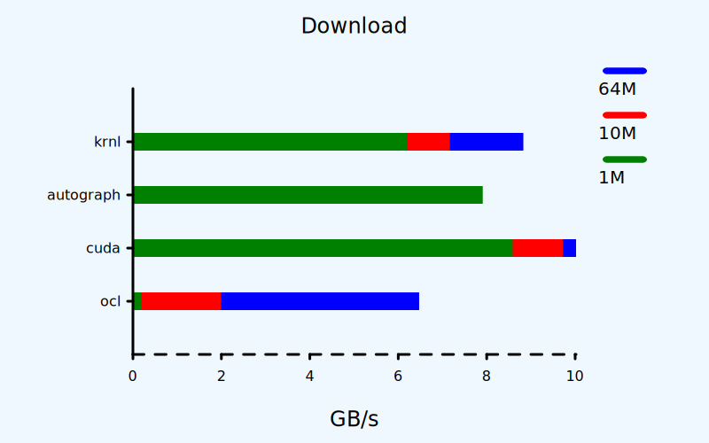
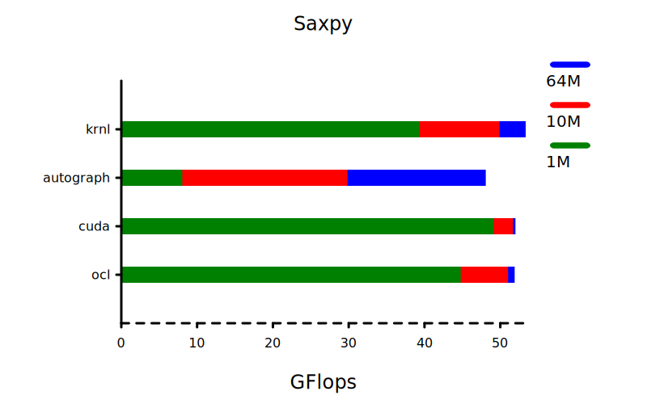

[![DocsBadge]][Docs]

[Docs]: https://docs.rs/krnl
[DocsBadge]: https://docs.rs/krnl/badge.svg

# **krnl**
Safe, portable, high performance compute (GPGPU) kernels.

Developed for [**autograph**](https://github.com/charles-r-earp/autograph). 
- Similar functionality to CUDA and OpenCL.
- Supports GPU's and other Vulkan 1.2 capable devices.
- MacOS / iOS supported via [MoltenVK](https://github.com/KhronosGroup/MoltenVK).
- Kernels are written inline, entirely in Rust.
- Simple iterator patterns can be implemented without unsafe.
- Buffers on the host can be accessed natively as Vecs and slices.

# **krnlc**
Kernel compiler for **krnl**. 
- Built on [RustGPU](https://github.com/EmbarkStudios/rust-gpu)'s spirv-builder.
- Supports dependencies defined in Cargo.toml. 
- Uses [spirv-tools](https://github.com/EmbarkStudios/spirv-tools-rs) to validate and optimize. 
- Compiles to "krnl-cache.rs", so the crate will build on stable Rust.

# Example

    use krnl::{
        anyhow::Result,
        buffer::{Buffer, Slice, SliceMut},
        device::Device,
        macros::module,
    };
    
    #[module]
    mod kernels {
        #[cfg(not(target_arch = "spirv"))]
        use krnl::krnl_core;
        use krnl_core::macros::kernel;
    
        pub fn saxpy_impl(x: f32, alpha: f32, y: &mut f32) {
            *y += alpha * x;
        }
    
        // Item kernels for iterator patterns.
        #[kernel(threads(256))]
        pub fn saxpy(#[item] x: f32, alpha: f32, #[item] y: &mut f32) {
            saxpy_impl(x, alpha, y);
        }
    
        // General purpose kernels like CUDA / OpenCL.
        #[kernel(threads(256))]
        pub fn saxpy_global(#[global] x: Slice<f32>, alpha: f32, #[global] y: UnsafeSlice<f32>) {
            use krnl_core::buffer::UnsafeIndex;
            let mut index = kernel.global_index() as usize;
            while index < x.len().min(y.len()) {
                saxpy_impl(x[index], alpha, unsafe { y.unsafe_index_mut(index) });
                index += kernel.global_threads() as usize;
            }
        }
    }
    
    fn saxpy(x: Slice<f32>, alpha: f32, mut y: SliceMut<f32>) -> Result<()> {
        if let Some((x, y)) = x.as_host_slice().zip(y.as_host_slice_mut()) {
            for (x, y) in x.iter().copied().zip(y) {
                kernels::saxpy_impl(x, alpha, y);
            }
            return Ok(());
        } 
        kernels::saxpy::builder()?
            .build(y.device())?
            .dispatch(x, alpha, y) 
    }
    
    fn main() -> Result<()> {
        let x = vec![1f32];
        let alpha = 2f32;
        let y = vec![0f32];
        let device = Device::builder().build().ok().unwrap_or(Device::host());
        let x = Buffer::from(x).into_device(device.clone())?;
        let mut y = Buffer::from(y).into_device(device.clone())?;
        saxpy(x.as_slice(), alpha, y.as_slice_mut())?;
        let y = y.into_vec()?;
        println!("{y:?}");
        Ok(())
    }

# Performance 

# Recent Changes 
See [Releases.md](https://github.com/charles-r-earp/krnl/blob/main/Releases.md)

# License
Dual-licensed to be compatible with the Rust project.

Licensed under the Apache License, Version 2.0 http://www.apache.org/licenses/LICENSE-2.0 or the MIT license http://opensource.org/licenses/MIT, at your option. This file may not be copied, modified, or distributed except according to those terms.

# Contribution
Unless you explicitly state otherwise, any contribution intentionally submitted for inclusion in the work by you, as defined in the Apache-2.0 license, shall be dual licensed as above, without any additional terms or conditions.
